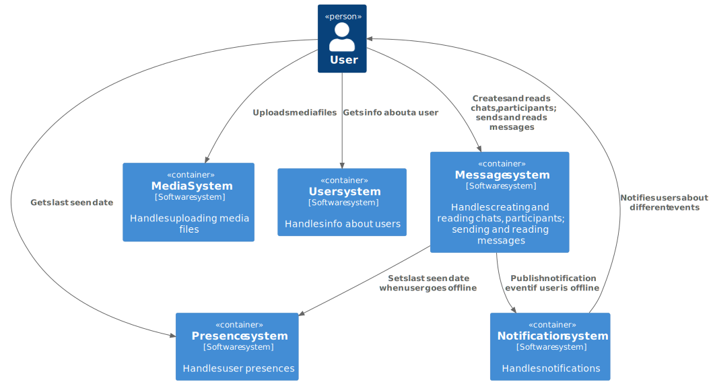
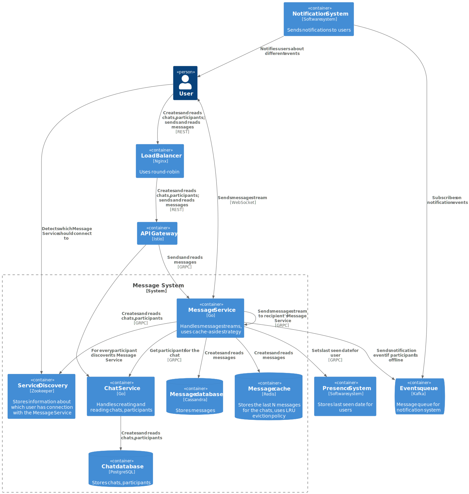
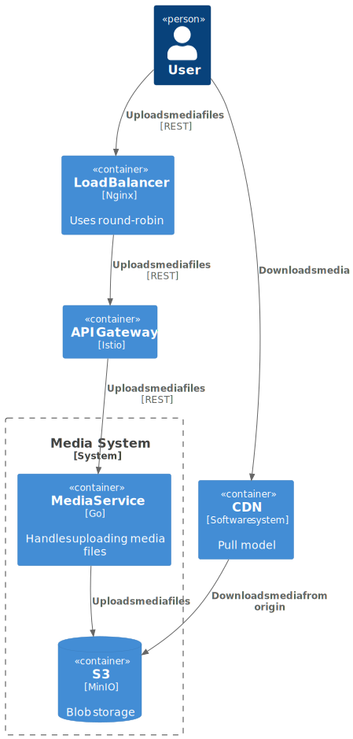
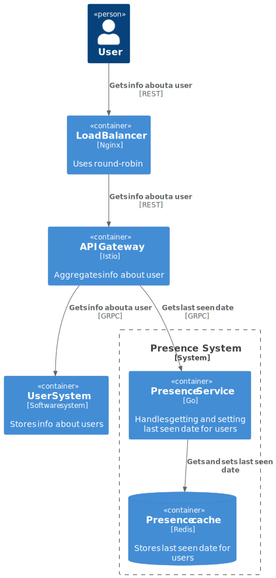

# Chatyx - System Design

This page describes the design of message system.

## Requirements

The system should meet the following requirements:

### Functional requirements

- Support groups and dialogs chats
- Add and remove participants for group chats
- Participants can leave from group chats
- Block opponents in dialogs
- Send text messages and images
- View unread messages
- Show online/offline statuses of users, as well as when the user was last online
- If the user is not online, they should receive a notification
- Support mobile and web version
- Support cross-device synchronization
- Geo distribution is not supported (CIS only)
- No seasonality

### Non-functional requirements

- 100 000 000 DAU
- Availability 99.95% (4.38 hours downtime per year)
- The system should be scalable and efficient
- A group can have a maximum of 100 participants
- A message should reach the recipient in 3 seconds
- A message should be sent in 1 second
- Each user sends an average of 10 messages per day
- Each user reads messages an average of 20 times per day
- The size of each message is a maximum of 2000 characters
- The size of each image is a maximum 1 MB
- Each message has a maximum 3 images
- 5% of messages contain images
- Store messages forever

## Basic estimation

### RPS

#### Sending messages

$$
\frac{100 \space million \times 10 \space messages \space per \space day}{(24 \space hrs \times 3600 \space seconds)} =
\sim 11574 \space requests/second
$$

#### Reading messages

$$
\frac{100 \space million \times 20 \space times \space per \space day}{(24 \space hrs \times 3600 \space seconds)} =
\sim 23148 \space requests/second
$$

### Traffic

Sending text messages:

$$
{11574 \space requests/second \times 2 \times 2000 \space bytes} = \sim 46.3 \space MB/second
$$

Sending images:

$$
{11574 \space requests/second \times 0.05 \times 1 \space MB} = \sim 578.7 \space MB/second
$$

Total:

$$
{46.3 \space MB/second + 578.7 \space MB/second} = 625 \space MB/second
$$

### Storage

Database size for storing messages for 10 years (without replication factor and image compression):

$$
{625 \space MB/second \times (24 \space hrs \times 3600 \space seconds) \times 365 \space days \times 10 \space years} =
\sim 197.1 \space PB
$$

## Design overview

  

    <b>Level 1.</b> System context diagram

  

    <b>Level 2.</b> Message system container diagram

  

    <b>Level 2.</b> Media system container diagram

  

    <b>Level 2.</b> Presence system container diagram

